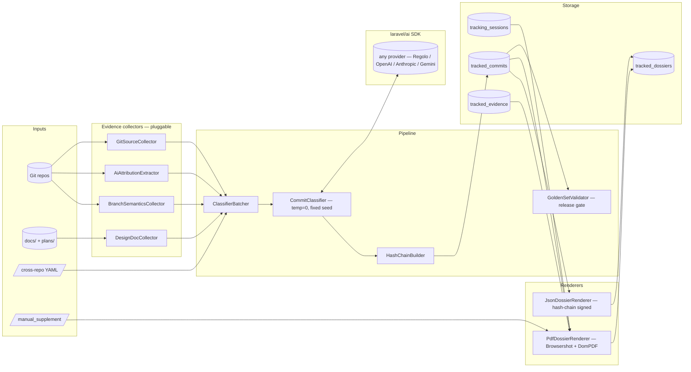

<h1 align="center">laravel-patent-box-tracker</h1>

<p align="center">
  <strong>Audit-grade Italian Patent Box dossier generator for Laravel.</strong><br/>
  Walks one or more git repositories, classifies every commit with a deterministic LLM pipeline, correlates the activity with design-doc evidence and AI-attribution markers, and emits a tamper-evident PDF + JSON dossier suitable for the Italian Patent Box (110% R&D super-deduction) regime — the artefact the taxpayer attaches to "documentazione idonea" filings with Agenzia delle Entrate.
</p>

<p align="center">
  <a href="https://github.com/padosoft/laravel-patent-box-tracker/actions/workflows/ci.yml"></a>
  <a href="https://packagist.org/packages/padosoft/laravel-patent-box-tracker"></a>
  <a href="https://packagist.org/packages/padosoft/laravel-patent-box-tracker"></a>
  <a href="LICENSE"></a>
  
  
  <a href="https://github.com/padosoft/laravel-patent-box-tracker/issues"></a>
</p>

---

## Table of contents

1. [Why this package](#why-this-package)
2. [Design rationale](#design-rationale)
3. [Features at a glance](#features-at-a-glance)
4. [Comparison vs alternatives](#comparison-vs-alternatives)
5. [Italian Patent Box primer](#italian-patent-box-primer)
6. [Installation](#installation)
7. [Quick start](#quick-start)
8. [Usage examples](#usage-examples)
9. [Configuration reference](#configuration-reference)
10. [Architecture](#architecture)
11. [🚀 AI vibe-coding pack included](#ai-vibe-coding-pack-included)
12. [Testing](#testing)
    - [Default suite — offline](#default-suite--offline-zero-cost-runs-everywhere)
    - [Running the live test suite](#running-the-live-test-suite-against-a-real-llm-provider)
13. [Roadmap](#roadmap)
14. [Contributing](#contributing)
15. [Security](#security)
16. [License & credits](#license--credits)

---

> ## Pre-release status
>
> All four W4 sub-tasks have shipped on `main`:
>
> - **W4.A** — package scaffold, `PatentBoxTrackerServiceProvider`, `config/patent-box-tracker.php`, the CI matrix on PHP 8.3 / 8.4 / 8.5 × Laravel 12 / 13, the `.claude/` vibe-coding pack, and the `Live` testsuite scaffold.
> - **W4.B.1** — four `EvidenceCollector` implementations (`GitSourceCollector`, `AiAttributionExtractor`, `DesignDocCollector`, `BranchSemanticsCollector`) + `CollectorRegistry` boot-time validation per R23.
> - **W4.B.2** — `CommitClassifier` + `ClassifierBatcher` + `CostCapGuard` + `GoldenSetValidator` + storage models (`TrackingSession`, `TrackedCommit`, `TrackedEvidence`, `TrackedDossier`).
> - **W4.C** — `PdfDossierRenderer` (Browsershot + DomPDF fallback) + `JsonDossierRenderer` + Italian Blade template + `HashChainBuilder` + `RenderCommand`.
> - **W4.D** — `TrackCommand` (`patent-box:track`) + `CrossRepoCommand` (`patent-box:cross-repo`) + `CrossRepoConfigValidator` + the fluent builder API documented in [Quick start](#quick-start).
>
> API v1 is now active, hardened and tested on:
>
> - `GET /api/patent-box/v1/health`
> - `GET /api/patent-box/v1/capabilities`
> - read endpoints per sessioni/commits/evidence/dossier/integrity
> - write endpoints con coda per tracciamento classificazione e render
> - optional API auth + rate limiter
> - unified API error/error code contract
>
> The next milestone is the `v0.1.1` tag and the corresponding Packagist publish. The Roadmap section below is now accurate; planned items are explicitly tagged for v0.2 and beyond.

## Why this package

The Italian **Patent Box** (regime "Nuovo Patent Box" introduced from FY2021 and consolidated under D.L. 146/2021 art. 6) grants a **110% super-deduction** on qualified R&D costs incurred to develop intangible assets — patents, registered software (SIAE), industrial designs. Each €1 of qualified R&D effectively saves around €0.30 of tax (IRPEF + IRAP + INPS combined for an Italian sole proprietor).

The mandatory counterpart is documentation. To survive an Agenzia delle Entrate audit, the taxpayer must produce on demand:

1. **Identification of the qualified IP** — patent number, SIAE registration ID, design certificate.
2. **Time-bound trail of R&D activity** — what was done, when, by whom, on which IP.
3. **Phase classification** of each activity — research, design, implementation, validation, documentation.
4. **Cost allocation** — hourly rates × hours × phase, mapped to fiscal-year buckets.
5. **Tamper-evident integrity** — the documentation must demonstrate it could not have been retroactively fabricated.

The current state of practice for software IP is **manually compiled spreadsheets reconstructed from memory, calendars, and Git logs**. This is expensive (a commercialista bills 8–20 hours per dossier) and error-prone (commits drift in classification, AI-assisted code is rarely separated, cross-repo work is hand-stitched).

`laravel-patent-box-tracker` replaces the manual reconstruction with a deterministic pipeline that walks the repositories and produces the same artefact in minutes — with hash-chain tamper evidence, deterministic-seeded LLM classification, and a hand-graded golden-set release gate.

### Dogfooding angle

The package was built **by an Italian Patent Box filer for Italian Patent Box filers**. Padosoft (ditta individuale) uses it to file the FY2026 dossier on the AskMyDocs IP and the Padosoft Apache-2.0 sister packages. Every release is validated against a real `feature/v4.x` history with commercialista review before tagging.

### Community angle

No equivalent package exists on Packagist as of 2026. The closest analogues — `gitinspector`, `commitlint` + custom downstream tooling, Toggl / Harvest plugins, commercialista Excel templates — solve adjacent problems but **none produce the documentation that Agenzia delle Entrate actually accepts** for the documentazione idonea regime. The market gap is real and large enough that the package is expected to drive its own adoption arc.

## Design rationale

A few decisions are worth surfacing up front, because they shape the package's footprint and the kind of bugs you can or cannot have.

### 1. Deterministic-seeded classifier, not "AI magic"

Every LLM call goes out with `temperature=0`, `top_p=1`, and a fixed `seed`. Re-running on the same commit produces an **identical** classification. The dossier metadata records the prompt, the model, and the seed, so a Patent Box auditor can re-execute the run and verify byte-for-byte. This is non-negotiable for an audit-grade artefact: a stochastic classifier is not "documentation" — it is "guesswork that happens to be written down".

### 2. Hand-graded golden set as a release gate

Before tagging `v0.1.0`, a 50-commit manually-labelled validation set is held to ≥ 80% F1. The golden set is drawn from real `feature/v4.x` history with the labels assigned by Lorenzo + a commercialista review. Synthetic accuracy claims ("the model says it works") do not pass the gate; only labels a fiscal reviewer signed off on do.

### 3. Provider-agnostic via `laravel/ai`

The classifier depends on the SDK abstraction, not on a specific provider. The default uses Regolo (Italian sovereign cloud, EUR-billed, GDPR-friendly), but anyone can swap to OpenAI, Anthropic, Gemini, or any other `laravel/ai` provider in one config line. The package itself ships zero provider credentials — they live in the consumer's `.env`.

### 4. Hash-chain tamper evidence

Every tracked commit gets `H(prev_hash || commit_sha)` recorded in the dossier. The full chain is published in the appendix of the PDF and as a manifest in the JSON sidecar. Any retroactive edit to the underlying repo is detectable; any retroactive edit to the dossier itself breaks the chain at the exact tampered row.

### 5. Standalone agnostic — no AskMyDocs glue

The package has **zero dependencies** on `lopadova/askmydocs` (CE), `padosoft/askmydocs-pro`, or any other Padosoft proprietary code. It works in any Laravel 12/13 application that has `laravel/ai` installed. The reverse direction is the only one that exists: AskMyDocs *uses* this package, never the inverse. An architecture test enforces the boundary on every CI run.

## Features at a glance

- **Audit-grade dossier** — Italian fiscal A4 portrait PDF + machine-readable JSON sidecar, suitable for the **documentazione idonea** regime under D.M. 6 ottobre 2022 + provv. AdE 15 febbraio 2023.
- **Deterministic LLM classifier** — `temperature=0`, fixed `seed`, recorded prompt and model version in the dossier metadata. Re-runs are byte-identical.
- **Hash-chain tamper evidence** — per-commit `H(prev_hash || commit_sha)` plus a SHA-256 of the entire JSON sidecar. Retroactive edits to either the repo or the dossier break the chain at the tampered row.
- **Four pluggable evidence collectors** — `GitSourceCollector`, `AiAttributionExtractor`, `DesignDocCollector`, `BranchSemanticsCollector`. Boot-time FQCN validation + non-overlapping `supports()` predicates.
- **Cross-repository orchestration** — single YAML config drives the dossier across N repos with per-repo roles (`primary_ip`, `support`, `meta_self`).
- **AI attribution detection** — parses `Co-Authored-By` trailers (Claude, Copilot, custom) and committer-email signatures into `human` / `ai_assisted` / `ai_authored` / `mixed` per commit.
- **Design-doc correlation** — auto-links commits to PLAN / ADR / spec / lessons-learned files by filename match, slug match, and date proximity.
- **Branch-semantics heuristics** — `feature/v4.0-W*-...` → development phase, `chore/*` → typically non-qualified, `fix/*` → context-dependent (pre-release qualifies, post-release maintenance does not).
- **Cost-cap hard stop** — pre-flight token-cost projection; aborts with exit code 2 before exceeding `cost_cap_eur_per_run` (default €50). No accidental classification of a 10-year-old monorepo at full price.
- **Three Artisan commands** — `patent-box:track`, `patent-box:render`, `patent-box:cross-repo`. Plus a fluent PHP builder API for programmatic use.
- **Hand-graded golden set ≥ 80% F1** — release gate enforced before every `v*.*.0` tag. Real `feature/v4.x` commits, real commercialista-validated labels.
- **Browsershot PDF + DomPDF fallback** — Chromium fidelity by default, DomPDF for environments where headless Chromium is unavailable.
- **Standalone agnostic** — zero dependency on `lopadova/askmydocs` or `padosoft/askmydocs-pro`. Works on any Laravel project. Composable with sister Padosoft packages.
- **Strict typing** — PHP 8.3+, readonly DTOs, fully-typed signatures, Pint-formatted, PHPStan analysis on every PR.
- **CI matrix** — every push runs against PHP 8.3 / 8.4 / 8.5 × Laravel 12 / 13 (6 cells).
- 🚀 **AI vibe-coding pack ships in the box** — every release includes the [Padosoft Claude pack](#ai-vibe-coding-pack-included) under `.claude/` (skills, rules, agents, slash-commands). The moment you `composer require` this package and open the project in Claude Code, the agent picks up Padosoft's house conventions automatically.
- 🧪 **Opt-in live test suite** — point `PATENT_BOX_LIVE_API_KEY` at a real provider key and run `vendor/bin/phpunit --testsuite Live` to verify classifier accuracy and PDF rendering against real APIs. Default suite remains 100% offline.

## Comparison vs alternatives

If you are evaluating how to assemble an Italian Patent Box dossier today, here are the realistic options on the table.

| Capability                                             | `gitinspector` + scripts | Toggl / Harvest plugins | Commercialista Excel templates | DIY git-log + spreadsheet | **`laravel-patent-box-tracker`** |
|--------------------------------------------------------|:------------------------:|:-----------------------:|:------------------------------:|:-------------------------:|:--------------------------------:|
| Walks git history per repo                             |             ✅           |            ❌           |              ❌                |             ✅            |                ✅                |
| Cross-repository orchestration                         |           ⚠️ DIY          |            ❌           |              ❌                |             ⚠️ DIY         |                ✅                |
| Phase classification (research/design/impl/etc.)       |             ❌           |          ⚠️ manual       |            ⚠️ manual            |           ⚠️ manual        |                ✅                |
| AI-attribution detection (`Co-Authored-By`)            |             ❌           |            ❌           |              ❌                |             ⚠️ DIY         |                ✅                |
| Design-doc evidence linking (PLAN / ADR / spec)        |             ❌           |            ❌           |              ❌                |             ⚠️ DIY         |                ✅                |
| Deterministic / reproducible runs                      |             ✅           |            ❌           |              ❌                |             ✅            |                ✅                |
| Hash-chain tamper evidence                             |             ❌           |            ❌           |              ❌                |             ❌            |                ✅                |
| Italian fiscal A4 PDF template                         |             ❌           |            ❌           |              ⚠️ partial         |             ❌            |                ✅                |
| Machine-readable JSON sidecar (gestionale-friendly)    |             ❌           |            ❌           |              ❌                |             ❌            |                ✅                |
| Cost-cap pre-flight guard                              |             N/A          |            N/A          |              N/A               |             N/A           |                ✅                |
| Hand-graded accuracy gate (≥ 80% F1)                   |             N/A          |            N/A          |              N/A               |             N/A           |                ✅                |
| Reproducible by Agenzia delle Entrate auditor          |             ⚠️ partial    |            ❌           |              ❌                |             ⚠️ partial     |                ✅                |
| Time to assemble FY dossier                            |          days            |          days           |          ~10–20 h              |          days             |             minutes              |

**Bottom line:** generic git-stat tools and time-trackers solve a different problem; commercialista Excel templates are the manual baseline this package replaces; DIY scripts duplicate the work each fiscal year. `laravel-patent-box-tracker` is the only option that produces the exact artefact the documentazione idonea regime expects, with the tamper-evidence and reproducibility a fiscal review demands.

## Italian Patent Box primer

> Skip this section if you already file Italian Patent Box dossiers.

The Patent Box is a tax incentive available to entrepreneurs (artigiani included), companies (SRL, SpA), and professionals (with VAT registration) that develop qualified intangible IP and incur R&D costs to do so.

| Element | Detail |
|---|---|
| **Qualified IP** | Software protected by copyright (typically registered with SIAE), patents (UIBM or EPO), industrial designs, certain trademarks before 2022. |
| **Qualified R&D costs** | Personnel, AI tooling subscriptions, cloud compute, contractor invoices, dedicated equipment, IP registration fees. Marketing, sales, generic admin do **NOT** qualify. |
| **Phase taxonomy** | Research, experimental development, design, implementation, integration, validation, documentation. Manutenzione (post-release bug fixes) does **NOT** qualify; pre-release fixes generally do. |
| **Documentation regime** | "Documentazione idonea" (D.M. 6 ottobre 2022 + provv. AdE 15 febbraio 2023) protects against monetary penalties on classification errors if the dossier is filed. Option communicated in the tax return. |
| **Cost calculation** | Qualified costs × 110% = additional deduction. The base 100% is already deducted normally; the +10% is the incentive. |
| **Audit window** | Agenzia delle Entrate can challenge the dossier within **5 fiscal years** from filing. |

This package targets the **documentazione idonea** regime: the output dossier is what the taxpayer attaches when communicating the option, and what they hand to Agenzia delle Entrate during audit.

## Installation

```bash
composer require laravel/ai
composer require padosoft/laravel-patent-box-tracker
```

The package auto-registers via Laravel's package discovery — no manual provider entry in `config/app.php` needed.

Publish the config:

```bash
php artisan vendor:publish --tag=patent-box-tracker-config
```

Run the migrations to create the storage tables (`tracking_sessions`, `tracked_commits`, `tracked_evidence`, `tracked_dossiers`):

```bash
php artisan migrate
```

Configure your `laravel/ai` provider of choice (Regolo is the default; OpenAI, Anthropic, Gemini all work). Minimal `.env`:

```dotenv
# Pick any laravel/ai provider — Regolo recommended for cost (~€0.05 per 1k commits).
REGOLO_API_KEY=rg_live_...
PATENT_BOX_DRIVER=regolo
PATENT_BOX_MODEL=claude-sonnet-4-6
```

## Quick start

### Single-repository dossier

```bash
php artisan patent-box:track /path/to/your/repo \
    --from=2026-01-01 --to=2026-12-31 \
    --provider=regolo --model=claude-sonnet-4-6
```

The command walks the repo, classifies every commit, persists a `tracking_session`, and prints the session id. Render the dossier:

```bash
php artisan patent-box:render <session-id> --format=pdf --out=storage/dossier-2026.pdf
php artisan patent-box:render <session-id> --format=json --out=storage/dossier-2026.json
```

### Cross-repository dossier (the canonical Padosoft use case)

Save your fiscal config under version control:

```yaml
# config/patent-box-2026.yml
fiscal_year: 2026
period:
  from: 2026-01-01
  to: 2026-12-31
tax_identity:
  denomination: Padosoft di Lorenzo Padovani
  p_iva: IT01234567890
  regime: documentazione_idonea
cost_model:
  hourly_rate_eur: 80
  daily_hours_max: 8
classifier:
  provider: regolo
  model: claude-sonnet-4-6
repositories:
  - path: /home/lpad/Code/askmydocs
    role: primary_ip
  - path: /home/lpad/Code/laravel-ai-regolo
    role: support
  - path: /home/lpad/Code/laravel-flow
    role: support
  - path: /home/lpad/Code/eval-harness
    role: support
  - path: /home/lpad/Code/laravel-pii-redactor
    role: support
  - path: /home/lpad/Code/laravel-patent-box-tracker
    role: meta_self
manual_supplement:
  off_keyboard_research_hours: 60
  conferences:
    - { name: "Laracon EU 2026", days: 3 }
ip_outputs:
  - kind: software_siae
    title: "AskMyDocs Enterprise Platform v4.0"
    registration_id: "SIAE-2026-..."
  - kind: brevetto_uibm
    title: "Canonical Knowledge Compilation Engine"
    application_id: "PCT/IT2026/..."
```

Then run:

```bash
php artisan patent-box:cross-repo config/patent-box-2026.yml
```

You get one consolidated dossier across N repositories, with cross-repo summaries and per-repo subtotals — in minutes.

## Usage examples

### Fluent builder API

```php
use Padosoft\PatentBoxTracker\PatentBoxTracker;

$session = PatentBoxTracker::for([
        '/path/to/askmydocs',
        '/path/to/laravel-ai-regolo',
        '/path/to/laravel-flow',
    ])
    ->coveringPeriod('2026-01-01', '2026-12-31')
    ->classifiedBy('regolo')
    ->withTaxIdentity([
        'denomination' => 'Padosoft di Lorenzo Padovani',
        'p_iva'        => 'IT01234567890',
        'fiscal_year'  => '2026',
        'regime'       => 'documentazione_idonea',
    ])
    ->withCostModel([
        'hourly_rate_eur' => 80,
        'daily_hours_max' => 8,
    ])
    ->run();

// $session is a TrackingSession Eloquent model with relations to TrackedCommit / TrackedEvidence.
```

### Render the dossier

```php
$dossier = $session->renderDossier()
    ->locale('it')
    ->toPdf();

$dossier->save(storage_path('dossier-2026.pdf'));

// JSON sidecar (machine-readable, hash-chain signed).
$session->renderDossier()->toJson()->save(storage_path('dossier-2026.json'));
```

### Inspect classification results

```php
use Padosoft\PatentBoxTracker\Models\TrackedCommit;

$qualified = TrackedCommit::query()
    ->where('tracking_session_id', $session->id)
    ->where('is_rd_qualified', true)
    ->orderByDesc('rd_qualification_confidence')
    ->get();

foreach ($qualified as $commit) {
    echo "{$commit->sha} [{$commit->phase}] {$commit->ai_attribution} — {$commit->rationale}\n";
}
```

### Verify hash chain integrity

```php
use Padosoft\PatentBoxTracker\Hash\HashChainBuilder;

$verified = HashChainBuilder::verify($session);

if (! $verified->isValid()) {
    throw new RuntimeException(
        "Tamper detected at commit {$verified->brokenAt} — chain breaks at this row."
    );
}
```

### Optional HTTP API (v1)

The package is CLI-first and fluent-API-first by default.  
To expose a versioned HTTP surface for admin panels, enable the API in config:

```php
'api' => [
    'enabled' => true,
    'prefix' => 'api/patent-box',
    'middleware' => ['api', 'auth:sanctum'], // host-app choice
],
```

Current v1 endpoints include:

- health and capabilities
- repository validation
- dry-run cost projection
- queued tracking-session creation
- tracking sessions/commits/evidence/dossiers read endpoints
- queued dossier render
- session-scoped dossier download
- hash-chain integrity verification

Reference: [`docs/API_REFERENCE.md`](docs/API_REFERENCE.md)

### Extending the pipeline with a custom collector

```php
use Padosoft\PatentBoxTracker\Sources\EvidenceCollector;

final class CalendarCollector implements EvidenceCollector
{
    public function supports(string $kind): bool
    {
        return $kind === 'calendar';
    }

    public function collect(array $context): array
    {
        // Walk Google Calendar / Outlook events, return Evidence DTOs.
        return [];
    }
}

// Register in a service provider:
$this->app->tag([CalendarCollector::class], 'patent-box.collectors');
```

The registry validates at boot that every tagged FQCN actually implements `EvidenceCollector`, and that no two collectors' `supports()` predicates overlap (R23).

## Configuration reference

The full default config lives at `config/patent-box-tracker.php`. Key entries:

| Key                                                | Type    | Default                           | Notes                                                                                  |
|----------------------------------------------------|---------|-----------------------------------|----------------------------------------------------------------------------------------|
| `patent-box-tracker.classifier.driver`             | string  | `regolo`                          | Any `laravel/ai` provider key (`openai`, `anthropic`, `gemini`, `regolo`, ...).        |
| `patent-box-tracker.classifier.model`              | string  | `env('PATENT_BOX_MODEL', 'claude-sonnet-4-6')` | Default classifier model. Heavier models trade cost for F1.                  |
| `patent-box-tracker.classifier.temperature`        | float   | `0`                               | **Do not change** unless you understand the audit-trail implications.                  |
| `patent-box-tracker.classifier.seed`               | int     | `0xC0DEC0DE`                      | Fixed seed for byte-identical re-runs.                                                 |
| `patent-box-tracker.classifier.batch_size`         | int     | `20`                              | Commits per LLM call. Higher = cheaper, lower = more diff context per commit.          |
| `patent-box-tracker.classifier.cost_cap_eur_per_run` | float | `50.00`                           | Hard stop. Run aborts with exit code 2 before exceeding this projected cost.           |
| `patent-box-tracker.regime`                        | string  | `documentazione_idonea`           | Italian Patent Box regime. `documentazione_idonea` enables the penalty-protection contract under D.M. 6 ottobre 2022; `non_documentazione` is the alternative. |
| `patent-box-tracker.locale`                        | string  | `it`                              | Dossier locale. `it` ships in v0.1; `en` and others planned for v0.2.                  |
| `patent-box-tracker.excluded_authors`              | array   | `['dependabot[bot]', 'renovate[bot]', 'github-actions[bot]']` | Author email substrings skipped during the git walk so bot-authored commits do not count as qualified R&D. |
| `patent-box-tracker.renderer.driver`               | string  | `browsershot`                     | `browsershot` (Chromium) or `dompdf` fallback.                                         |
| `patent-box-tracker.renderer.browsershot.chrome_path` | string\|null | `null`                       | Override the headless Chromium binary path; defaults to Browsershot's auto-detection.  |
| `patent-box-tracker.renderer.browsershot.timeout`  | int     | `60`                              | Browsershot render timeout (seconds).                                                  |

The W4.A scaffold ships exactly the keys listed above. Cost-model inputs (`hourly_rate_eur`, `daily_hours_max`), evidence-collector knobs (`docs_paths`, `proximity_days`, `first_parent_only`), and storage routing (`disk`) are added by W4.B / W4.C alongside the code that reads them — the documentation evolves with the feature surface, not ahead of it. Every key is also overridable per-call via the fluent builder or the YAML cross-repo config (W4.D).

## Architecture



A few notes on the architecture:

- **Collectors are independent.** Each implements `EvidenceCollector` with a non-overlapping `supports()` predicate. v0.1 ships four; future versions add more without breaking the registry.
- **The classifier is the only LLM-touching component.** Everything upstream is deterministic git + filesystem walk. Everything downstream is template rendering + cryptographic hashing. The non-determinism budget is bounded to one component, and that component runs at `temperature=0` with a fixed seed.
- **Storage is the audit trail.** `tracking_sessions` records the classifier provider / model / seed; `tracked_commits` records the hash chain; `tracked_dossiers` records the SHA-256 of every rendered artefact. The dossier you hand to Agenzia delle Entrate is reproducible from the same DB at any point within the 5-year audit window.

## 🚀 AI vibe-coding pack included

> **Every Padosoft package ships with the same `.claude/` pack, so AI-driven contribution stays consistent across the family.**

Every release of this package includes the [Padosoft Claude pack](.claude/) under the `.claude/` directory: the same skills, rules, agents, and slash-commands the Padosoft team uses internally to keep AI-driven development consistent across all our repos. The moment you `composer require padosoft/laravel-patent-box-tracker` and open the project in [Claude Code](https://claude.com/claude-code), the agent automatically picks up the pack and applies it.

### What ships in the pack

```
.claude/
├── skills/
│   ├── copilot-pr-review-loop/         ← R36: 9-step PR flow (--reviewer copilot,
│   │                                       wait CI green, wait Copilot review,
│   │                                       fix, re-CI, merge only when both green)
│   ├── branching-strategy-feature-vx/  ← R37: feature/v*.*.x integration branches
│   ├── ci-failure-investigation/       ← R22: artefact-first CI failure protocol
│   ├── pluggable-pipeline-registry/    ← R23: FQCN validation + supports() mutex
│   ├── docs-match-code/                ← R9: README / config / migration drift gate
│   └── (more skills sync'd from sister padosoft/* packages)
├── rules/                              ← Padosoft baseline coding rules
└── agents/
    ├── copilot-review-anticipator      ← pre-push review sub-agent
    └── classifier-prompt-tuner         ← package-specific golden-set tuner
```

### Why this matters

When a contributor (you, a team-mate, an open-source PR author) opens this repo in Claude Code:

1. The agent reads the pack on session start.
2. The R36 PR-review skill kicks in automatically the first time the contributor types `gh pr create`. The agent uses `--reviewer copilot-pull-request-reviewer`, waits for CI, waits for Copilot review, addresses comments, re-checks CI, and only merges when both gates are green.
3. Future skills (style enforcement, security review, release-note generator, ...) plug into the same pack with zero configuration on the consumer side.

The result: **you get the Padosoft AI engineering culture in the same `composer require` that gets you the Patent Box tracker.**

### Opting out

Do not want the pack? Add `.claude/` to your `.gitignore` (or delete it locally). The package code under `src/` works completely independently of the pack — the pack is purely a developer-experience layer for repos that use Claude Code.

### Want to contribute a skill?

The same pack is shared across `padosoft/laravel-ai-regolo`, `padosoft/laravel-flow`, `padosoft/eval-harness`, `padosoft/laravel-pii-redactor`, and `padosoft/laravel-patent-box-tracker` — open a PR on any of those repos and we will sync the skill across the family.

## Testing

### Default suite — offline, zero cost, runs everywhere

The package ships a comprehensive offline test suite that runs against `Http::fake()` for the LLM, recorded git fixtures for the repo walks, and synthetic `docs/` trees for the design-doc correlator. The test suite never hits a real API and is safe to run in CI on every PR.

```bash
composer install
vendor/bin/phpunit
```

Coverage breakdown:

| Suite                              | What it covers                                                                                           |
|------------------------------------|----------------------------------------------------------------------------------------------------------|
| `CommitClassifierTest`             | Fixture commit + canned LLM response → expected `CommitClassification`. `Http::fake()` only.             |
| `GitSourceCollectorTest`           | Recorded bare repo `tests/fixtures/repos/synthetic-r-and-d.git` (30 commits, 5 phases) → exact metadata. |
| `AiAttributionExtractorTest`       | 12 commit-message variants → expected attribution flag (`human` / `ai_assisted` / `ai_authored` / `mixed`). |
| `DesignDocCollectorTest`           | Synthetic `docs/` tree → expected evidence-link graph (filename / slug / date-proximity matches).        |
| `BranchSemanticsCollectorTest`     | Branch-name patterns (`feature/v4.0-W*`, `chore/`, `fix/`) → expected semantics.                         |
| `HashChainBuilderTest`             | Same input → same chain. Tampering one commit breaks the chain at that exact position.                   |
| `JsonDossierRendererTest`          | Round-trip a synthetic session → JSON → re-parse → re-render produces byte-identical output.             |
| `GoldenSetValidatorTest`           | Synthetic golden set + synthetic classifier outputs → F1 score matches a hand-computed value.            |
| `TrackCommandTest`                 | `php artisan patent-box:track <fixture-repo>` end-to-end with `Http::fake()`. No live HTTP calls.        |
| `CrossRepoCommandTest`             | YAML config + 3 fixture repos → one session with 3 repository-roles, cross-repo summary correct.         |
| `RenderCommandTest`                | Pre-populated session → PDF exists, page count > 1, JSON sidecar valid against schema.                   |
| `StandaloneAgnosticTest`           | Architecture test — package source contains zero `KnowledgeDocument` / `KbSearchService` / `lopadova/*` references. |

CI matrix: PHP **8.3 / 8.4 / 8.5** × Laravel **12 / 13** (6 cells), plus a separate static-analysis job that runs PHPStan and Pint.

### Running the live test suite (against a real LLM provider)

If you want to verify behaviour against real provider servers — for example you are validating a model upgrade, an open-source contributor confirming wire compatibility before tagging a release, or a downstream adopter doing a pre-deploy smoke-test — the package ships a dedicated **`Live`** PHPUnit testsuite that hits a real `laravel/ai` provider end-to-end.

The live suite is **opt-in by design**:

- A fresh `git clone` + `composer install` + `vendor/bin/phpunit` runs only the offline suite. No accidental cost.
- The `Live` suite **self-skips** when `PATENT_BOX_LIVE_API_KEY` is missing, so it cannot accidentally fail a CI job that does not have credentials.
- The CI matrix on this repo runs **only** the offline suite. Live tests run only when invoked explicitly with `--testsuite Live`.

#### 1. Configure the environment

The bare minimum is a single env var:

```bash
export PATENT_BOX_LIVE_API_KEY=rg_live_...
```

Optional overrides (defaults pick the same models the package ships as defaults):

```bash
export PATENT_BOX_LIVE_PROVIDER=regolo
export PATENT_BOX_LIVE_MODEL=claude-sonnet-4-6
export PATENT_BOX_LIVE_FIXTURE_REPO=/path/to/a/small/test/repo
```

On Windows PowerShell:

```powershell
$env:PATENT_BOX_LIVE_API_KEY = "rg_live_..."
```

#### 2. Run the live suite

```bash
vendor/bin/phpunit --testsuite Live
```

…or, with the testdox formatter so each scenario prints by name:

```bash
vendor/bin/phpunit --testsuite Live --testdox
```

#### What the live suite verifies

| File                          | What it asserts on the real provider                                                            | Cost          |
|-------------------------------|-------------------------------------------------------------------------------------------------|---------------|
| `ClassifierLiveTest`          | 5 hand-picked real `feature/v4.x` commits → ≥ 80% match against the golden labels.              | ~€0.05        |
| `RendererLiveTest`            | Generates a real PDF and validates it opens in `pdf-parser` without errors.                     | minimal       |

**Total cost per run**: well under €0.10 with the default small-model selection. Pick a heavier model via `PATENT_BOX_LIVE_MODEL` if you want to validate a specific catalogue entry — the cost scales linearly.

#### CI policy

The live suite is **never** run from this package's `.github/workflows/ci.yml`. The matrix invokes `vendor/bin/phpunit` (default config = offline suite). To run the live suite in your own pipeline:

```yaml
- name: Live verification (manual workflow_dispatch only)
  if: env.PATENT_BOX_LIVE_API_KEY != ''
  env:
    PATENT_BOX_LIVE_API_KEY: ${{ secrets.PATENT_BOX_LIVE_API_KEY }}
  run: vendor/bin/phpunit --testsuite Live
```

Open an issue or PR if you want a `workflow_dispatch` job added to this repo to support scheduled live verification.

## Roadmap

| Version | Status   | Highlights                                                                                                  |
|---------|----------|-------------------------------------------------------------------------------------------------------------|
| v0.1    | code complete; tag pending | 4 evidence collectors + deterministic LLM classifier + Italian PDF + JSON sidecar + hash-chain tamper evidence + cross-repo YAML orchestration + cost-cap guard + hand-graded golden set ≥ 80% F1 + opt-in Live testsuite + AI vibe-coding pack. **First public release.** |
| v0.2    | planned  | Time-tracking integrations (Toggl / Harvest / RescueTime / Clockify). Calendar collector for off-keyboard R&D. Live terminal session capture (Cursor / Claude Code). Token-by-token AI-vs-human line-level attribution. English locale for the dossier template. |
| v0.3    | planned  | Direct UIBM / SIAE / EPO API integration — auto-link IP filings to dossier entries.                         |
| v1.0    | tracking | Web UI dashboard (Filament panel). Tax-jurisdiction support beyond Italy (UK Patent Box, Irish Knowledge Box, German FuE-Zulage). Multi-tenant SaaS deployment. |

Open issues and feature votes: [github.com/padosoft/laravel-patent-box-tracker/issues](https://github.com/padosoft/laravel-patent-box-tracker/issues).

## Contributing

Contributions are welcome — bug reports, test cases, new evidence collectors, golden-set commits with commercialista-validated labels, documentation polish.

1. Fork the repository.
2. Create a feature branch (`feature/your-thing`) targeting `main`.
3. Run `vendor/bin/phpunit` and `vendor/bin/pint --test` locally.
4. Open a PR with a clear description, a test that covers the change, and (if you touch the classifier prompt) a re-run of the golden-set validator showing F1 ≥ 80%.

We follow the project conventions documented in [`CONTRIBUTING.md`](CONTRIBUTING.md). Please respect the existing concern split (`src/Sources/`, `src/Classifier/`, `src/Renderers/`, `src/Hash/`) when adding capabilities — it keeps the package legible and audit-friendly.

### Adding a new evidence collector

1. Implement `Padosoft\PatentBoxTracker\Sources\EvidenceCollector`.
2. Make sure your `supports()` predicate does **not** overlap with any existing collector — the boot-time mutex check (R23) will refuse to register otherwise.
3. Tag the FQCN with `patent-box.collectors` in your service provider.
4. Add a Unit test that exercises the collector against a synthetic fixture.

## Security

Found a security issue? Please **do not open a public issue**. Email `lorenzo.padovani@padosoft.com` instead. We follow standard responsible-disclosure timelines documented in [`SECURITY.md`](SECURITY.md).

Special note on dossier integrity: if you discover a way to mutate a tracked dossier without breaking the hash chain, this is a **critical** finding — please flag it as such in the disclosure. The chain is the audit-trail anchor; an integrity break is a release blocker.

## License & credits

Apache-2.0 — see [`LICENSE`](LICENSE).

Built and maintained by [Padosoft](https://padosoft.com), authored by Lorenzo Padovani. Initially developed alongside [AskMyDocs](https://github.com/lopadova/AskMyDocs) — and dogfooded against Padosoft's own FY2026 Italian Patent Box dossier — but the package is fully **standalone agnostic**: no AskMyDocs dependency, no Padosoft proprietary glue. It works in any Laravel 12/13 application that has `laravel/ai` installed.

Sister packages in the Padosoft AI stack:

- [`padosoft/laravel-ai-regolo`](https://github.com/padosoft/laravel-ai-regolo) — first-class Regolo (Italian sovereign AI) provider for `laravel/ai`.
- [`padosoft/laravel-flow`](https://github.com/padosoft/laravel-flow) — saga / workflow orchestration for Laravel.
- [`padosoft/eval-harness`](https://github.com/padosoft/eval-harness) — RAG + agent evaluation harness.
- [`padosoft/laravel-pii-redactor`](https://github.com/padosoft/laravel-pii-redactor) — PII redaction middleware for AI prompts.

Each is independently usable. None requires the others. Pick what you need.

---

<p align="center">
  <sub>Made with ☕ in Italy by <a href="https://padosoft.com">Padosoft</a>.</sub>
</p>
