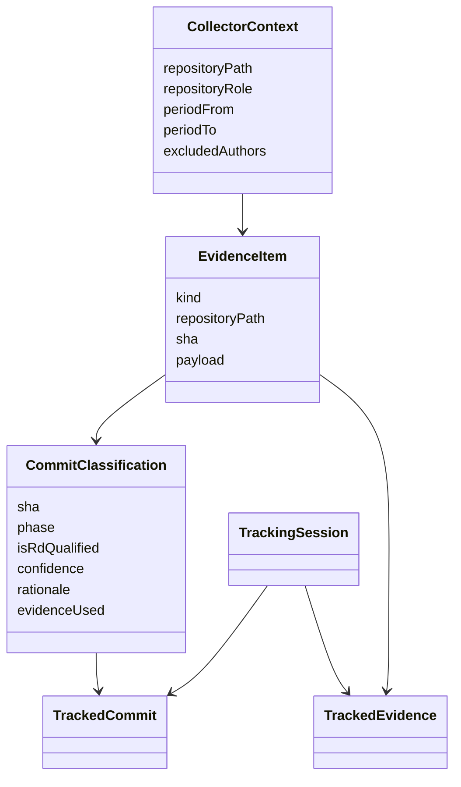

# Design

The design favors reproducibility over convenience. Each stage stores enough metadata to explain the next stage.

## Why Collectors

Collectors keep evidence acquisition pluggable:

- `GitSourceCollector` walks commits,
- `AiAttributionExtractor` detects AI markers,
- `DesignDocCollector` links docs to activity,
- `BranchSemanticsCollector` adds branch naming context.

::: callout info
Collector FQCNs are validated at boot. Custom collectors must implement the expected contract and avoid overlapping support predicates unless explicitly exempted.
:::
