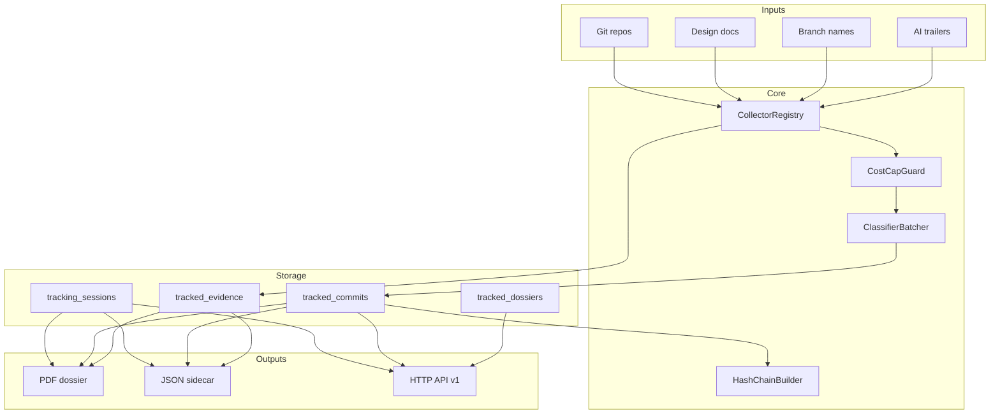

# Architecture Overview

The package is headless-first. The CLI and HTTP API both route through the same collectors, classifiers, models, and renderers.

## Boundaries

The package owns tracking tables, classifiers, collector orchestration, renderers, and API endpoints. The host Laravel app owns authentication policy, queue workers, database connection, storage location, and `laravel/ai` provider credentials.
