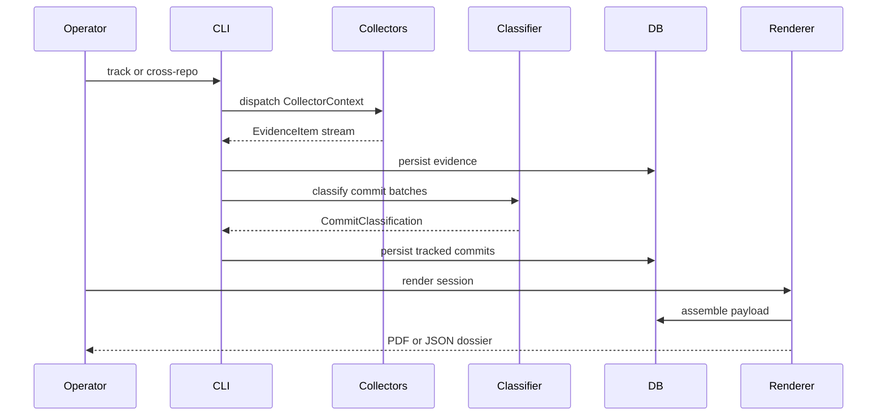

# Pipeline Workflow

The pipeline is deliberately split into small stages so each artifact can be reviewed and reproduced.



::: steps
1. Validate repository path, period, role, and tax identity.
2. Dispatch collectors for commits, AI attribution, design docs, and branch semantics.
3. Persist evidence before classifier calls.
4. Project cost, enforce the configured cap, and classify in batches.
5. Store the phase, qualification flag, rationale, and evidence used per commit.
6. Render the dossier and record byte size plus SHA-256.
:::

## Hash Chain

Each tracked commit stores `hash_chain_prev` and `hash_chain_self`.

```text
self_hash_n = sha256(previous_hash_n + commit_sha_n)
```

If a commit is rewritten or a dossier row is edited, the chain no longer verifies at the changed row.
