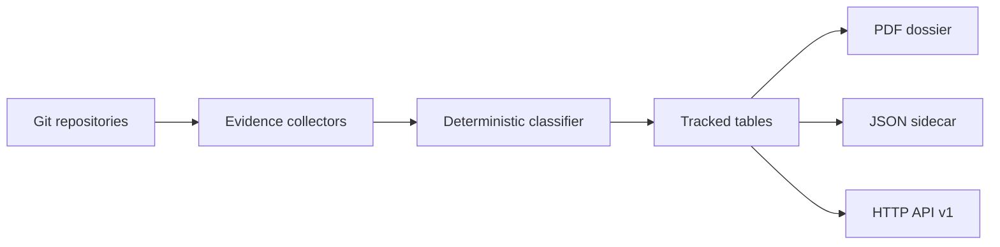

# laravel-patent-box-tracker

`padosoft/laravel-patent-box-tracker` walks one or more git repositories, classifies R&D activity through a deterministic LLM pipeline, correlates commits with design evidence and AI-attribution markers, then renders an Italian fiscal PDF dossier plus JSON sidecar.

::: callout info
The package is built for the Italian Patent Box `documentazione idonea` workflow. It helps produce reproducible evidence, not legal or tax advice.
:::

::: grids
::: grid
::: card
**Deterministic classifier**

Temperature zero, fixed seed, recorded prompt, provider, and model.
:::
::: card
**Tamper evidence**

Per-commit hash chain and dossier SHA-256 make retrospective edits visible.
:::
::: card
**CLI, PHP, HTTP**

Use Artisan commands, the fluent builder, or the stable opt-in HTTP API v1.
:::
:::
:::

## When to use it

Use this package when a Laravel application or operations app must produce an audit trail for software R&D work across one or more git repositories.

## Package Metadata

| Field | Value |
| --- | --- |
| Package | `padosoft/laravel-patent-box-tracker` |
| Author | Lorenzo Padovani |
| Organization | Padosoft |
| License | Apache-2.0 |
| Main audience | Laravel teams preparing Italian Patent Box evidence |

## First Steps

::: steps
1. Install the package and publish migrations.
2. Configure `laravel/ai`, classifier model, fiscal identity, and renderer.
3. Run a dry run to estimate classifier cost.
4. Track the repositories.
5. Render and verify the dossier.
:::

Continue with [Quickstart](/get-started/quickstart).
