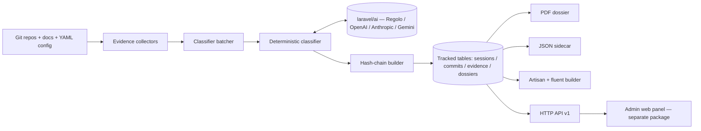

# laravel-patent-box-tracker


> **laravel-patent-box-tracker turns the git history you already have into the documentation Agenzia delle Entrate actually accepts.**
> It walks one or more repositories, classifies every commit's R&D phase with a deterministic LLM
> pipeline, correlates the activity with design-doc evidence and AI-attribution markers, then emits a
> tamper-evident Italian fiscal PDF + JSON dossier — reproducible byte-for-byte by an auditor.

::: callout info "New here? Read this page top to bottom" icon:compass
In five minutes you'll know exactly what this package is, the expensive problem it kills, why it beats
every spreadsheet-and-consultant approach, and where to click next. Every other page goes deeper —
this one gives you the whole picture.
:::

---

## What it is — in one minute

The Italian **Patent Box** ("Nuovo Patent Box", D.L. 146/2021 art. 6) grants a **110% super-deduction**
on qualified R&D costs spent developing intangible IP — registered software (SIAE), patents, designs.
Each €1 of qualified R&D saves roughly €0.30 of tax. The catch is the paperwork: to survive an audit
under the **documentazione idonea** regime you must produce, on demand, a time-bound, phase-classified,
cost-allocated, **tamper-evident** trail of every R&D activity.

Today that trail is hand-built — spreadsheets reconstructed from memory, calendars and git logs, billed
at 8–20 hours per dossier by a commercialista, and still fragile (commit classification drifts,
AI-assisted code is never separated, cross-repo work is stitched by hand).

`laravel-patent-box-tracker` replaces the manual reconstruction with a deterministic pipeline:

- **Walk the repositories** — pluggable evidence collectors read git history, AI-attribution trailers,
  design-doc links and branch semantics across N repos with per-repo roles.
- **Classify every commit** — a `temperature=0`, fixed-seed LLM call labels phase
  (research / design / implementation / validation / documentation) and R&D-qualification, recording the
  prompt, model and seed so a re-run is **byte-identical**.
- **Emit the dossier** — an Italian fiscal A4 PDF + machine-readable JSON sidecar, every row anchored
  by a per-commit hash chain and a per-dossier SHA-256.

> **In one line:** *the package that produces the Patent Box dossier Agenzia delle Entrate expects —
> deterministic, hash-chain tamper-evident, reproducible, in minutes instead of days.*

---

## The problem it solves

Every Italian software filer hits the same wall: the incentive is real money, but the documentation is
manual, expensive and fragile. Here is the gap this package closes.

| Without laravel-patent-box-tracker | With laravel-patent-box-tracker |
|---|---|
| A commercialista bills 8–20 hours reconstructing each fiscal year from memory, calendars and git logs. | The pipeline walks the repos and emits the full dossier **in minutes** — every fiscal year, repeatable. |
| Phase classification is hand-assigned and drifts between commits and reviewers. | A **deterministic** `temperature=0` + fixed-seed classifier labels every commit reproducibly, prompt and model recorded. |
| AI-assisted code is never separated from human work — a growing audit risk. | `Co-Authored-By` trailers and committer signatures resolve each commit to `human` / `ai_assisted` / `ai_authored` / `mixed`. |
| Cross-repository work is stitched together by hand, fiscal year after fiscal year. | One YAML config drives **N repos** with per-repo roles into a single consolidated dossier. |
| Nothing proves the dossier wasn't fabricated after the fact. | A **per-commit hash chain + per-dossier SHA-256** — any retroactive edit breaks the chain at the exact tampered row. |
| "The model says it's R&D" is not documentation — an auditor can't reproduce it. | The dossier records prompt + model + seed; an Agenzia delle Entrate auditor can **re-execute and verify byte-for-byte**. |
| A careless run could classify a 10-year monorepo at full LLM price. | A **cost-cap pre-flight guard** projects token cost and aborts (exit code 2) before exceeding your cap. |

---

## Who it's for

::: grids
  ::: grid
    ::: card "Italian software companies & freelancers" icon:building-2
    Ditte individuali, SRL and professionals with VAT registration who develop registered software, patents or designs and want to claim the 110% Patent Box super-deduction without months of manual paperwork.
    :::
  :::
  ::: grid
    ::: card "CFOs, commercialisti & tax advisors" icon:calculator
    Drive sessions, review classifications, fix labels and download a fiscal A4 PDF + JSON sidecar that maps qualified costs to fiscal-year buckets — the artefact attached to documentazione idonea filings.
    :::
  :::
  ::: grid
    ::: card "R&D & engineering teams" icon:git-branch
    Your real audit evidence already lives in git. Point the tracker at your repos and the dossier is reconstructed from the source of truth — no parallel timesheet to keep in sync.
    :::
  :::
  ::: grid
    ::: card "Laravel platform teams" icon:layers
    CLI-first, API-first, fully standalone. Drop it into any Laravel 12/13 app that has `laravel/ai`, run it headless, or mount the stable HTTP API v1 for automations and the companion admin panel.
    :::
  :::
:::

---

## Why it's different — the moats

Generic git-stat tools and time-trackers solve an adjacent problem. None produces the documentation the
documentazione idonea regime actually expects. Here is what you won't get anywhere else.

::: grids
  ::: grid
    ::: card "Deterministic classifier, not 'AI magic'" icon:scan-search
    Every LLM call goes out with `temperature=0`, `top_p=1` and a fixed `seed`. Re-running on the same commit produces an **identical** classification — and the dossier records the prompt, model and seed so an auditor can re-execute it.
    :::
  :::
  ::: grid
    ::: card "Hash-chain tamper evidence" icon:link
    Every commit records `H(prev_hash || commit_sha)`; the whole chain is published in the PDF appendix and JSON manifest, plus a SHA-256 of the entire sidecar. Any retroactive edit breaks the chain at the exact tampered row.
    :::
  :::
  ::: grid
    ::: card "Commit ↔ evidence correlation" icon:file-search
    Four pluggable collectors fuse the signal: git source, AI-attribution trailers, design-doc links (PLAN / ADR / spec by filename, slug and date proximity) and branch semantics — boot-time FQCN validation, non-overlapping `supports()` predicates.
    :::
  :::
  ::: grid
    ::: card "Audit-ready Italian fiscal dossier" icon:file-badge
    An A4 portrait PDF (Browsershot/Chromium, DomPDF fallback) + machine-readable JSON sidecar, built for documentazione idonea under D.M. 6 ottobre 2022 + provv. AdE 15 febbraio 2023 — gestionale-friendly out of the box.
    :::
  :::
  ::: grid
    ::: card "Hand-graded golden-set release gate" icon:badge-check
    Before every `v*.*.0` tag, a manually-labelled validation set from real `feature/v4.x` history must hold **≥ 80% F1**, with commercialista review. Synthetic "it works" claims don't pass — only labels a fiscal reviewer signed off on do.
    :::
  :::
  ::: grid
    ::: card "Cross-repository orchestration" icon:folder-tree
    One YAML config drives the dossier across N repositories with per-repo roles (`primary_ip`, `support`, `meta_self`), cross-repo summaries and per-repo subtotals — one consolidated artefact in minutes.
    :::
  :::
  ::: grid
    ::: card "Cost-cap pre-flight guard" icon:shield-check
    The run projects token cost before any LLM call and aborts with exit code 2 over `cost_cap_eur_per_run` (default €50). No accidental full-price classification of a decade-old monorepo.
    :::
  :::
  ::: grid
    ::: card "Provider-agnostic & standalone" icon:plug
    The classifier depends on the `laravel/ai` SDK, not a provider — Regolo (sovereign, EUR-billed) by default, OpenAI / Anthropic / Gemini in one config line. Zero dependency on AskMyDocs or any Padosoft proprietary glue.
    :::
  :::
  ::: grid
    ::: card "Three surfaces, one core" icon:boxes
    Artisan commands + a fluent PHP builder, a stable opt-in **HTTP API v1** (versioned `{data, meta, error}` envelope, fixed error taxonomy), and a separate companion admin web panel — all reading the same storage and dossier artefacts.
    :::
  :::
:::

---

## See it: the companion admin panel

This package is **CLI-first and API-first**. For non-technical users — commercialista, auditor, project
lead — a production-grade Laravel admin UI ships separately as
[`padosoft/laravel-patent-box-tracker-admin`](https://github.com/padosoft/laravel-patent-box-tracker-admin):
FY-bound KPIs, phase distribution, AI-attribution split, a hash-chain integrity badge, the recent-sessions
table, classification audit trail, cost projection and PDF preview. It is just a typed client on top of
this package's `/api/patent-box/v1/...` contract — anything it does, you can do with cURL.


---

## laravel-patent-box-tracker vs. the alternatives

| Capability | **laravel-patent-box-tracker** | Manual spreadsheets | Commercialista consultants | Generic time-tracking (Toggl/Harvest) |
|---|:---:|:---:|:---:|:---:|
| Walks git history per repo | ✅ | ❌ | ➖ | ❌ |
| Cross-repository orchestration | ✅ | ❌ | ➖ | ❌ |
| Phase classification (research/design/impl/…) | ✅ | ➖ | ➖ | ➖ |
| AI-attribution detection (`Co-Authored-By`) | ✅ | ❌ | ❌ | ❌ |
| Design-doc evidence linking (PLAN/ADR/spec) | ✅ | ❌ | ➖ | ❌ |
| Deterministic, reproducible runs | ✅ | ❌ | ❌ | ❌ |
| Hash-chain tamper evidence | ✅ | ❌ | ❌ | ❌ |
| Italian fiscal A4 PDF + JSON sidecar | ✅ | ➖ | ➖ | ❌ |
| Reproducible by an Agenzia delle Entrate auditor | ✅ | ❌ | ➖ | ❌ |
| Time to assemble an FY dossier | minutes | days | ~10–20 h | days |

> Legend: ✅ built-in · ➖ partial / manual / extra cost · ❌ not available.

---

## How it fits together

Deterministic git + filesystem collectors feed one LLM-touching classifier (`temperature=0`, fixed
seed); the hash chain anchors every row; renderers emit the dossier; three delivery surfaces read the
same storage.



The classifier is the only non-deterministic component, and it runs pinned to one number:

$$
classification = f(commit, evidence) \;\; \text{at} \;\; temperature = 0,\; seed = \text{fixed}
$$

---

## Start in 30 seconds

::: steps
1. **Install the package**
   ```bash
   composer require laravel/ai
   composer require padosoft/laravel-patent-box-tracker
   php artisan vendor:publish --tag=patent-box-tracker-config
   php artisan migrate
   ```
   Auto-discovered — no manual provider entry. Point a `laravel/ai` provider at it in `.env`
   (Regolo by default; OpenAI / Anthropic / Gemini all work):
   ```dotenv
   REGOLO_API_KEY=rg_live_...
   PATENT_BOX_DRIVER=regolo
   PATENT_BOX_MODEL=claude-sonnet-4-6
   ```

2. **Track a single repository for a fiscal year**
   ```bash
   php artisan patent-box:track /path/to/your/repo \
       --from=2026-01-01 --to=2026-12-31 \
       --provider=regolo --model=claude-sonnet-4-6
   ```
   The command walks the repo, classifies every commit, persists a `tracking_session` and prints its id.

3. **Render and verify the dossier**
   ```bash
   php artisan patent-box:render <session-id> --format=pdf  --out=storage/dossier-2026.pdf
   php artisan patent-box:render <session-id> --format=json --out=storage/dossier-2026.json
   ```
   The PDF is the documentazione idonea artefact; the JSON sidecar carries the hash-chain manifest for
   tamper verification.
:::

**[→ Quickstart](/get-started/quickstart)** · **[→ Installation](/get-started/installation)** · **[→ Worked Example](/guides/worked-example)**

---

## Batteries included for AI-assisted development

This repo ships **AI batteries** — a `CLAUDE.md` working guide, an `AGENTS.md` workflow contract and
invocable `.claude/skills/` encoding the macro-branch + subtask-PR loop, the Copilot review flow and the
docs-sync discipline. Open the package in Claude Code, Cursor, Copilot or Codex and your agent already
knows the house rules — the same pack ships across the whole Padosoft AI stack.

---

## Where to go next

::: grids
  ::: grid
    ::: card "Quickstart" icon:zap
    Install, track your first repo and render a dossier in minutes. **[Open →](/get-started/quickstart)**
    :::
  :::
  ::: grid
    ::: card "Architecture Overview" icon:boxes
    The collector → classifier → hash-chain → renderer pipeline, the data model and the ADRs behind the design. **[Explore →](/architettura/overview)**
    :::
  :::
  ::: grid
    ::: card "HTTP API reference" icon:terminal
    The stable, opt-in `/api/patent-box/v1` surface — envelope, error taxonomy, integrity check. **[Read →](/reference/http-api)**
    :::
  :::
:::

::: callout tip "Package facts" icon:info
Composer `padosoft/laravel-patent-box-tracker` · PHP `^8.3` (8.4/8.5) · Laravel `12 || 13` ·
backbone `laravel/ai` · Apache-2.0 · stable HTTP API v1 ·
[GitHub](https://github.com/padosoft/laravel-patent-box-tracker) · [Packagist](https://packagist.org/packages/padosoft/laravel-patent-box-tracker)
:::
